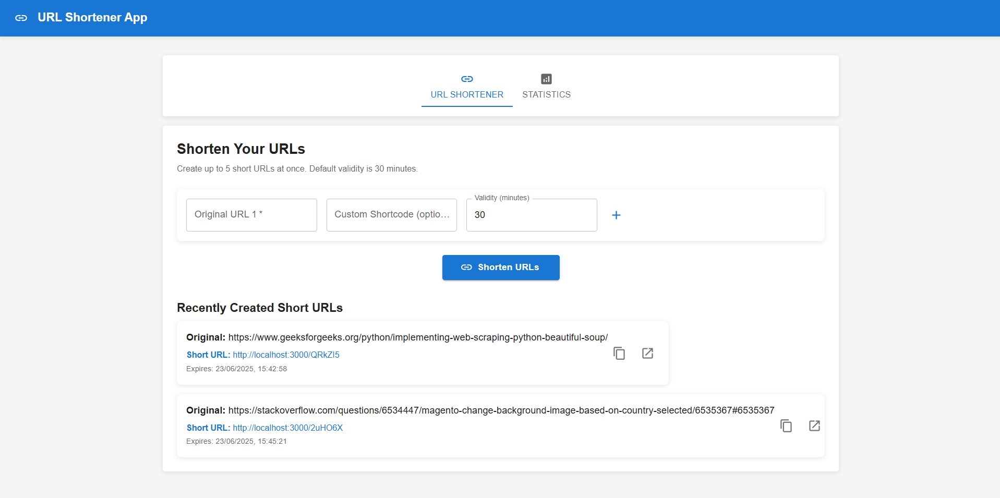
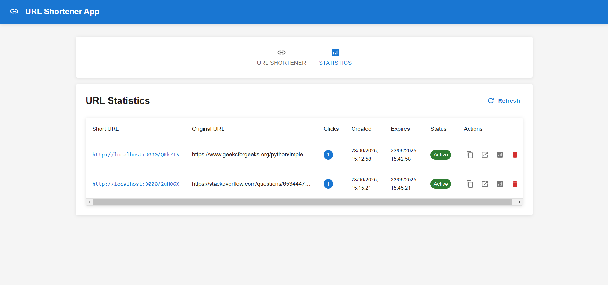

# URL Shortener Application

A modern React-based URL shortener with analytics, custom shortcodes, and robust logging middleware.

---

## Features

- 🔗 **Shorten up to 5 URLs at once** (with custom shortcodes and validity)
- 🕒 **Set validity period** (default: 30 minutes)
- 📊 **Statistics dashboard** with click tracking and location info
- 🚦 **Client-side routing** for short URL redirection
- 📝 **Comprehensive logging** via middleware (API-integrated)
- 🎨 **Material-UI design** for a clean, responsive interface

---

## Screenshots

| Home / Shortener | Statistics |
|------------------|------------|
|  |  |

---

## Getting Started

### Prerequisites

- Node.js (v14+)
- npm

### Installation

```bash
git clone https://github.com/your-username/url-shortener-app.git
cd url-shortener-app
npm install
npm start
```

Visit [http://localhost:3000](http://localhost:3000) in your browser.

---

## Usage

1. **Shorten URLs:**  
   Enter up to 5 URLs, set custom shortcodes (optional), and validity (minutes). Click "Shorten URLs" to generate links.

2. **Access Short URLs:**  
   Use the generated short URLs. The app will redirect to the original URL if valid.

3. **View Statistics:**  
   Switch to the "Statistics" tab to see all your short URLs, click counts, and details.

---

## Project Structure

- `src/App.js` – Main application logic and routing
- `src/logging-middleware.js` – Logging middleware for API logging
- `screenshots/` – App screenshots for documentation

---

## Logging Middleware

- All user actions and errors are logged to the evaluation API.
- Uses Bearer token, Client ID, and Secret for authentication.
- Logs include stack, level, package, and message.

---

## Tech Stack

- **Frontend:** React 18, React Router
- **UI:** Material-UI (MUI v5)
- **State:** React Hooks, localStorage
- **Logging:** Custom middleware, API integration

---

## Notes

- All data is stored in browser localStorage (for demo purposes).
- No user authentication required.
- App must run on `http://localhost:3000` for evaluation.

---

## License

MIT
